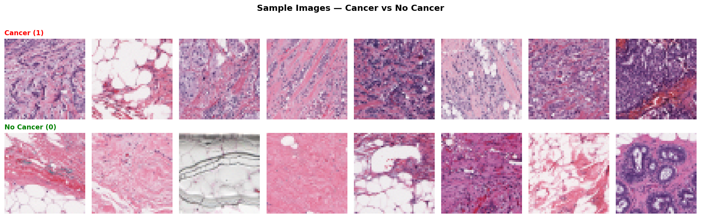
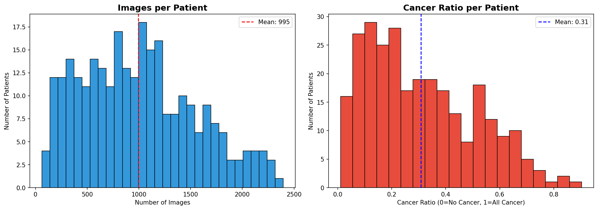
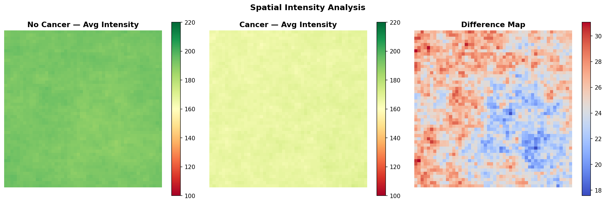
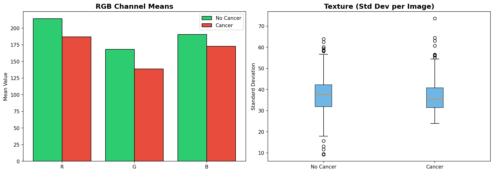
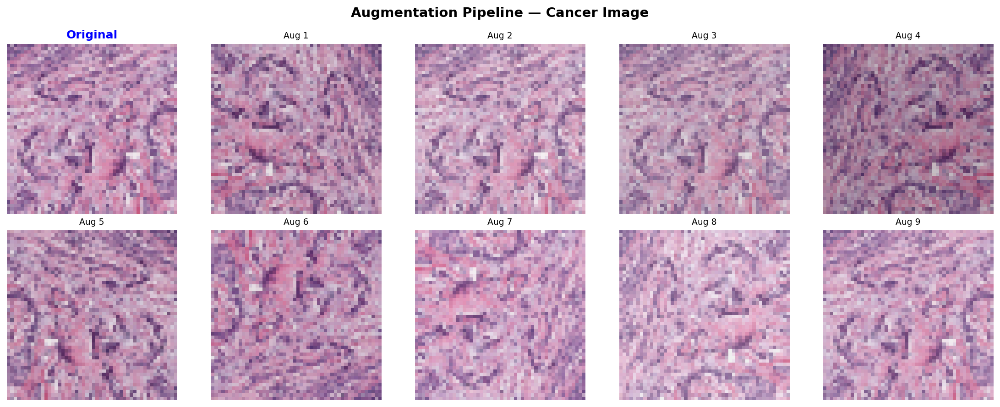

# Model 1 - Breast Cancer Detection

## Overview
Binary classification model to detect Invasive Ductal Carcinoma (IDC) from breast histopathology images.

## Performance
| Metric | Value |
|--------|-------|
| AUC-ROC | 0.9432 |
| Sensitivity | 94.64% |
| Specificity | 76.13% |
| F1 Score | 0.78 |
| Optimal Threshold | 0.3 |

## Dataset
- IDC Breast Histopathology Images
- 277,524 images (50x50px patches)
- Patient-wise stratified split (70/15/15)

## Architecture
- Base: DenseNet121 (ImageNet pretrained)
- Head: GAP -> BN -> Dense(256) -> Dropout(0.5) -> Dense(128) -> Sigmoid
- Phase 1: Frozen base (LR=1e-4, 15 epochs)
- Phase 2: Fine-tuning (LR=1e-5, 10 epochs)

## EDA

### Class Distribution

### Sample Images

### Pixel Intensity

### Patient Distribution

### Spatial Analysis

### Image Stats

### Augmentation

## Links
- Model: https://huggingface.co/Abdulhaque/breast-cancer-detection
- Demo: https://huggingface.co/spaces/Abdulhaque/cancer-detection-app
