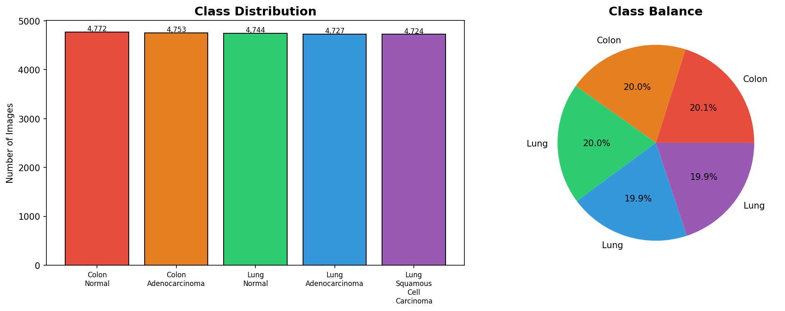
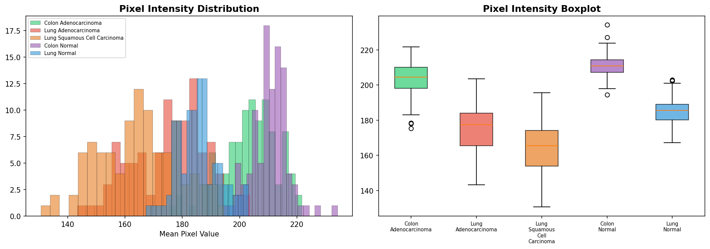
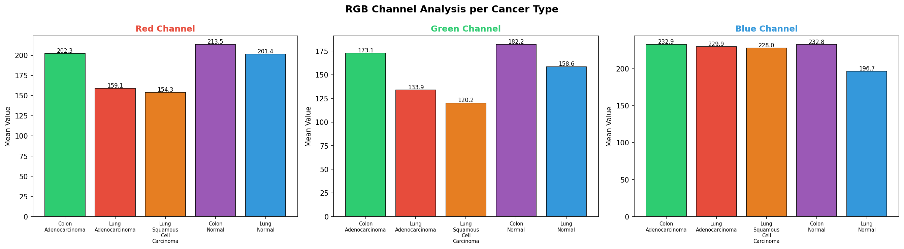
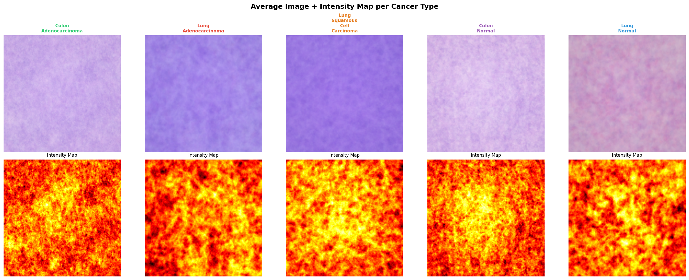
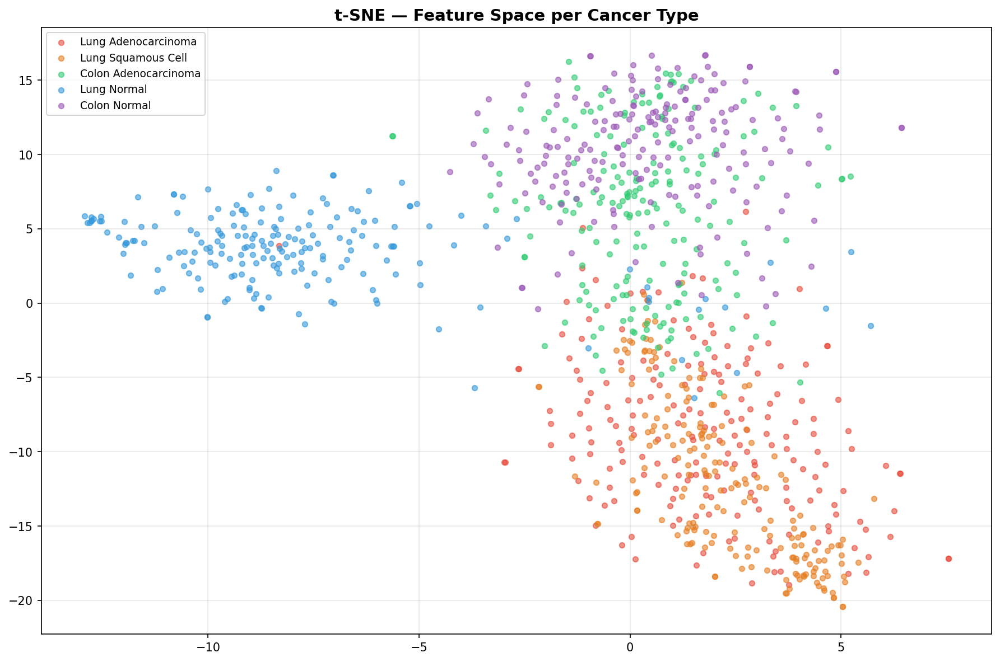
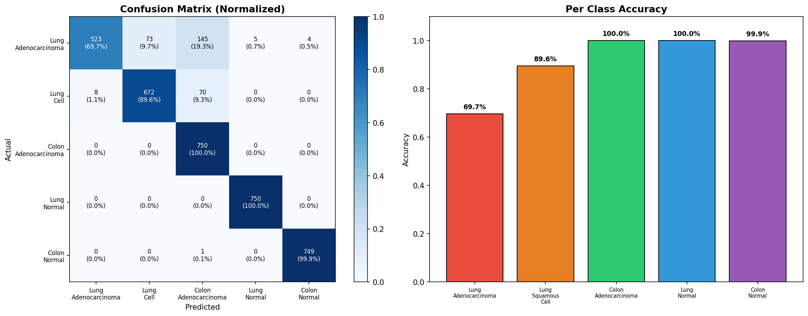
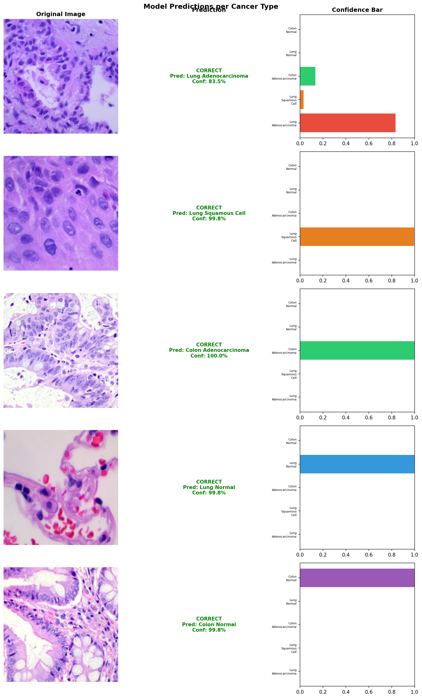
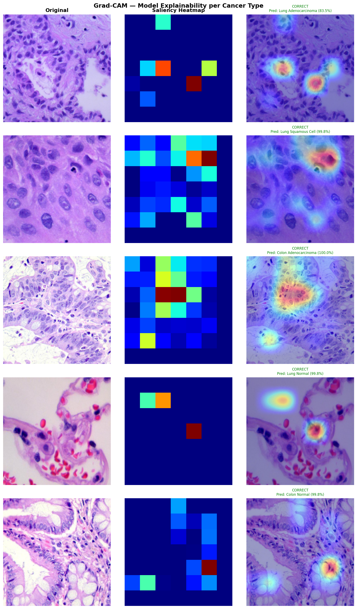

# Model 2 - Cancer Type Classification

## Overview
5-class classification model to identify cancer type from histopathology images.

## Classes
| Label | Class | Type |
|-------|-------|------|
| 0 | Lung Adenocarcinoma | Cancer |
| 1 | Lung Squamous Cell Carcinoma | Cancer |
| 2 | Colon Adenocarcinoma | Cancer |
| 3 | Lung Normal | Normal |
| 4 | Colon Normal | Normal |

## Performance
| Metric | Value |
|--------|-------|
| Val Accuracy | 94.19% |
| Test Accuracy | 94.0% |
| Val AUC | 0.9942 |
| Top-2 Accuracy | 99%+ |

## Dataset
- LC25000 Histopathology Dataset
- 25,000 images (224x224px)
- Perfectly balanced (5000 per class)

## Architecture
- Base: ConvNeXt-Base (ImageNet pretrained)
- Head: GAP -> BN -> Dense(512) -> Dropout(0.5) -> Dense(256) -> Softmax(5)
- Phase 1: Frozen base (LR=1e-4, 15 epochs)
- Phase 2: Fine-tuning (LR=1e-5, 10 epochs)

## EDA

### Class Distribution

### Sample Images

### Pixel Intensity

### RGB Channel Analysis

### Spatial Analysis

### t-SNE Feature Space

## Evaluation

### Confusion Matrix

### Predictions

### Grad-CAM

## Links
- Model: https://huggingface.co/Abdulhaque/cancer-type-classification
- Demo: https://huggingface.co/spaces/Abdulhaque/cancer-type-classification-app
